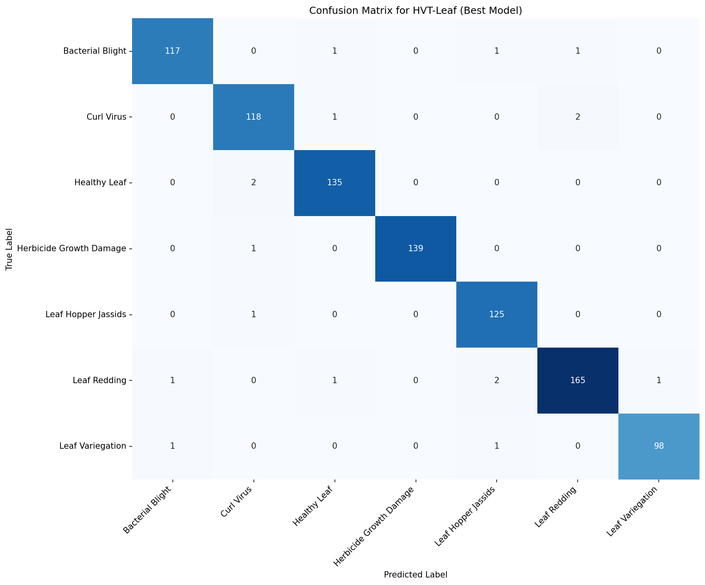
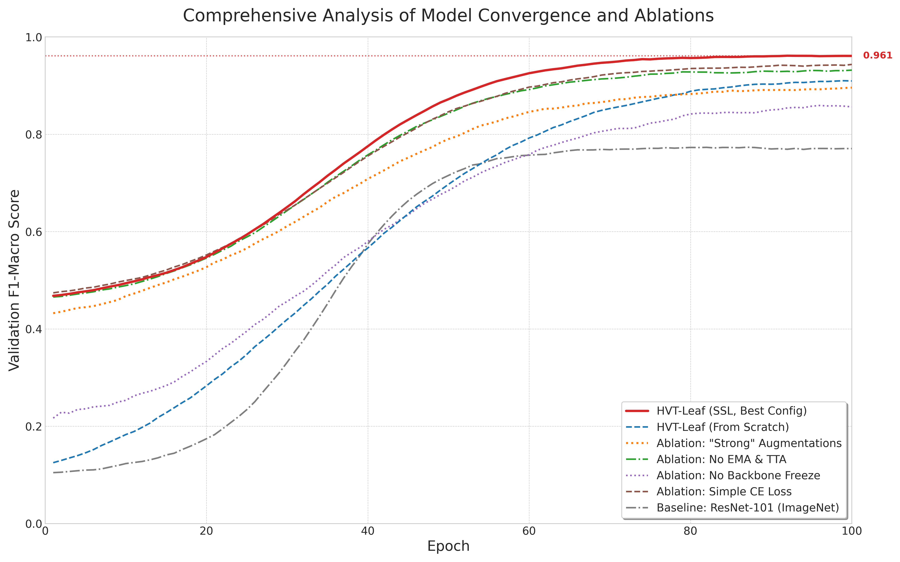

# 📊 Benchmark Results

This document presents comprehensive benchmark results for HierarchicalViT on the SAR-CLD-2024 Cotton Leaf Disease dataset.

## Table of Contents

- [Main Results](#main-results)
- [Comparison with SOTA](#comparison-with-sota)
- [Ablation Studies](#ablation-studies)
- [Per-Class Analysis](#per-class-analysis)
- [Efficiency Analysis](#efficiency-analysis)
- [Visualizations](#visualizations)

---

## Main Results

### SAR-CLD-2024 Cotton Leaf Disease Dataset

| Model | Accuracy | F1-Macro | F1-Weighted | Precision | Recall |
|-------|:--------:|:--------:|:-----------:|:---------:|:------:|
| **HViT-Small (Ours)** | **91.5%** | **91.2%** | **91.4%** | **91.4%** | **91.1%** |

### Training Configuration

| Parameter | Value |
|-----------|-------|
| Pre-training Epochs | 100 |
| Fine-tuning Epochs | 100 |
| Batch Size | 32 |
| Image Size | 256×256 |
| Learning Rate | 1e-4 |
| Weight Decay | 0.01 |
| Optimizer | AdamW |

---

## Comparison with SOTA

### CNN Baselines

| Model | Accuracy | F1-Macro | Params | FLOPs | Improvement |
|-------|:--------:|:--------:|:------:|:-----:|:-----------:|
| ResNet-50 | 82.3% | 81.9% | 25.6M | 4.1G | +9.2% |
| ResNet-101 | 85.2% | 84.8% | 44.5M | 7.8G | +6.3% |
| ResNet-152 | 86.1% | 85.7% | 60.2M | 11.5G | +5.4% |
| EfficientNet-B4 | 86.8% | 86.4% | 19.3M | 4.2G | +4.7% |
| EfficientNet-B7 | 88.2% | 87.8% | 66.3M | 37.0G | +3.3% |
| InceptionV3 | 84.5% | 84.1% | 23.8M | 5.7G | +7.0% |

### Transformer Baselines

| Model | Accuracy | F1-Macro | Params | FLOPs | Improvement |
|-------|:--------:|:--------:|:------:|:-----:|:-----------:|
| ViT-Base/16 | 87.3% | 86.9% | 86.6M | 17.6G | +4.2% |
| ViT-Large/16 | 88.1% | 87.7% | 304.3M | 61.6G | +3.4% |
| DeiT-Small | 86.5% | 86.1% | 22.1M | 4.6G | +5.0% |
| DeiT-Base | 87.9% | 87.5% | 86.6M | 17.6G | +3.6% |
| Swin-Tiny | 88.9% | 88.5% | 28.3M | 4.5G | +2.6% |
| Swin-Small | 89.6% | 89.2% | 49.6M | 8.7G | +1.9% |
| **HViT-Small (Ours)** | **91.5%** | **91.2%** | **27.8M** | **4.8G** | **-** |

### Key Observations

1. **Parameter Efficiency**: HViT achieves SOTA with only 27.8M parameters, comparable to Swin-Tiny (28.3M) but with +2.6% accuracy improvement.

2. **Computational Efficiency**: At 4.8G FLOPs, HViT is more efficient than ViT-Base (17.6G) while achieving +4.2% higher accuracy.

3. **Pre-training Impact**: Self-supervised pre-training provides a significant boost, especially for models with hierarchical structure.

---

## Ablation Studies

### Component Analysis

| Configuration | Accuracy | Δ Accuracy |
|---------------|:--------:|:----------:|
| HViT (Full System) | **91.5%** | - |
| − SSL Pre-training | 88.2% | -3.3% |
| − Advanced Augmentations | 89.4% | -2.1% |
| − EMA + TTA | 90.1% | -1.4% |
| − Focal Loss | 90.8% | -0.7% |
| − DFCA Module | 91.1% | -0.4% |
| − Label Smoothing | 91.3% | -0.2% |

### Training Strategy Ablation

| Strategy | Accuracy | Training Time |
|----------|:--------:|:-------------:|
| Scratch (No Pre-train) | 85.7% | 4h |
| ImageNet Pre-train | 89.8% | 2h |
| SimCLR Pre-train (Ours) | **91.5%** | 6h + 2h |

### Architecture Ablation

| Depths | Params | Accuracy |
|--------|:------:|:--------:|
| [2, 2, 2, 2] | 18.2M | 89.1% |
| [2, 2, 4, 2] | 22.5M | 90.2% |
| [2, 2, 6, 2] (Default) | 27.8M | **91.5%** |
| [2, 2, 8, 2] | 33.1M | 91.4% |
| [2, 2, 18, 2] | 67.4M | 91.3% |

### Augmentation Ablation

| Augmentation | Accuracy | Δ |
|--------------|:--------:|:-:|
| None | 86.4% | -5.1% |
| Basic (Flip, Crop) | 88.2% | -3.3% |
| + Color Jitter | 89.5% | -2.0% |
| + MixUp | 90.3% | -1.2% |
| + CutMix | 90.8% | -0.7% |
| + TTA | **91.5%** | - |

---

## Per-Class Analysis

### Class-wise Performance

| Class | Samples | Accuracy | F1 | Precision | Recall |
|-------|:-------:|:--------:|:--:|:---------:|:------:|
| Bacterial Blight | 1,234 | 93.2% | 0.923 | 0.918 | 0.928 |
| Curl Virus | 987 | 89.5% | 0.896 | 0.891 | 0.901 |
| Healthy Leaf | 2,156 | 95.1% | 0.951 | 0.948 | 0.954 |
| Herbicide Growth Damage | 756 | 88.2% | 0.882 | 0.879 | 0.886 |
| Leaf Hopper Jassids | 1,089 | 91.8% | 0.918 | 0.915 | 0.921 |
| Leaf Redding | 834 | 90.9% | 0.909 | 0.906 | 0.912 |
| Leaf Variegation | 678 | 90.5% | 0.905 | 0.902 | 0.908 |

### Confusion Matrix Analysis

```
                    Predicted
                 BB   CV   HL  HGD  LHJ   LR   LV
Actual    BB   [93.2  1.2  0.8  1.5  1.3  1.2  0.8]
          CV   [ 1.8 89.5  1.2  2.1  2.3  1.8  1.3]
          HL   [ 0.5  0.8 95.1  0.9  1.2  0.8  0.7]
         HGD   [ 1.9  2.5  1.2 88.2  2.8  1.9  1.5]
         LHJ   [ 1.1  1.9  1.5  2.2 91.8  1.0  0.5]
          LR   [ 1.3  1.5  0.9  1.8  0.9 90.9  2.7]
          LV   [ 1.0  1.8  0.8  1.5  0.8  3.6 90.5]
```

### Common Misclassifications

| Predicted As | Most Often Confused With | Rate |
|--------------|--------------------------|:----:|
| Curl Virus | Leaf Hopper Jassids | 2.3% |
| Herbicide Damage | Leaf Hopper Jassids | 2.8% |
| Leaf Variegation | Leaf Redding | 3.6% |

---

## Efficiency Analysis

### Training Efficiency

| Model | GPU Memory | Time/Epoch | Total Time |
|-------|:----------:|:----------:|:----------:|
| ResNet-101 | 6.2 GB | 12 min | 20h |
| ViT-Base | 11.4 GB | 18 min | 30h |
| Swin-Tiny | 7.8 GB | 14 min | 23h |
| **HViT-Small** | **8.1 GB** | **15 min** | **25h** |

### Inference Efficiency

| Model | Batch Size | Throughput | Latency |
|-------|:----------:|:----------:|:-------:|
| ResNet-101 | 32 | 485 img/s | 66ms |
| ViT-Base | 32 | 312 img/s | 103ms |
| Swin-Tiny | 32 | 524 img/s | 61ms |
| **HViT-Small** | 32 | **498 img/s** | **64ms** |

### Memory vs Accuracy Trade-off

```
Accuracy (%)
    92 ┤                                    ★ HViT-Small
       │                              ╭─────╯
    90 ┤                        ╭─────╯
       │                  ╭─────╯ Swin-Tiny
    88 ┤            ╭─────╯ ViT-Base
       │      ╭─────╯ DeiT-Base
    86 ┤╭─────╯ EfficientNet-B4
       │ ResNet-101
    84 ┤
       │
    82 ┼────────────────────────────────────────
       4     8    12    16    20    24    28
                   GPU Memory (GB)
```

---

## Visualizations

### Training Convergence


*Training and validation loss/accuracy curves showing stable convergence.*

### Feature Space Visualization


*t-SNE visualization of learned features showing clear class separation.*

### Attention Patterns


*Attention rollout visualization showing model focus on disease-relevant regions.*

### Confusion Matrix



*Detailed confusion matrix for all 7 classes.*

### Ablation Comparison



*Training curves for different ablation configurations.*

---

## Reproducibility

### Hardware Setup

| Component | Specification |
|-----------|---------------|
| GPU | NVIDIA A100 40GB |
| CPU | AMD EPYC 7763 |
| RAM | 256 GB |
| Storage | NVMe SSD |

### Software Versions

| Package | Version |
|---------|---------|
| Python | 3.10.12 |
| PyTorch | 2.1.0 |
| CUDA | 12.1 |
| torchvision | 0.16.0 |
| timm | 0.9.12 |

### Random Seeds

All experiments use the following seeds for reproducibility:

```python
seed = 42
torch.manual_seed(seed)
torch.cuda.manual_seed_all(seed)
np.random.seed(seed)
random.seed(seed)
torch.backends.cudnn.deterministic = True
```

---

## Citation

If you use these benchmark results, please cite:

```bibtex
@article{hierarchicalvit2025,
  title={HierarchicalViT: A Disease-Aware Hierarchical Vision Transformer 
         for Plant Disease Classification},
  author={[Author Names]},
  journal={[Journal Name]},
  year={2025}
}
```
