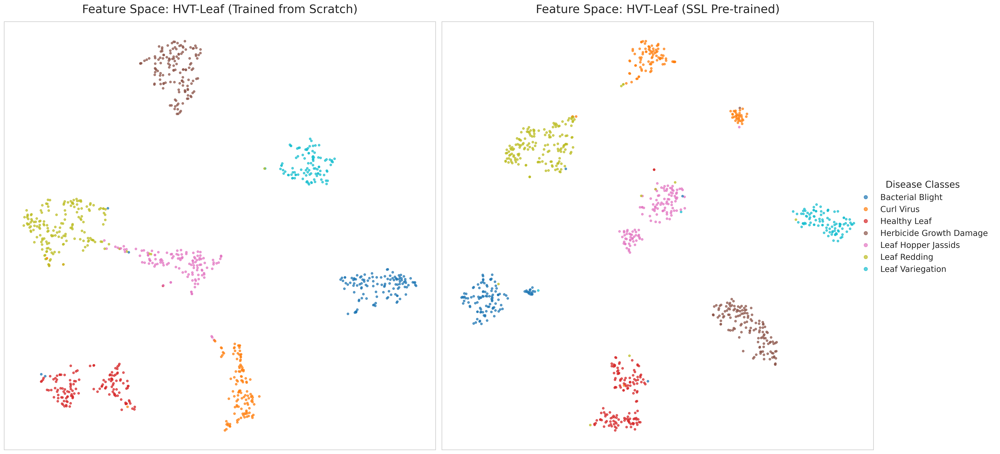
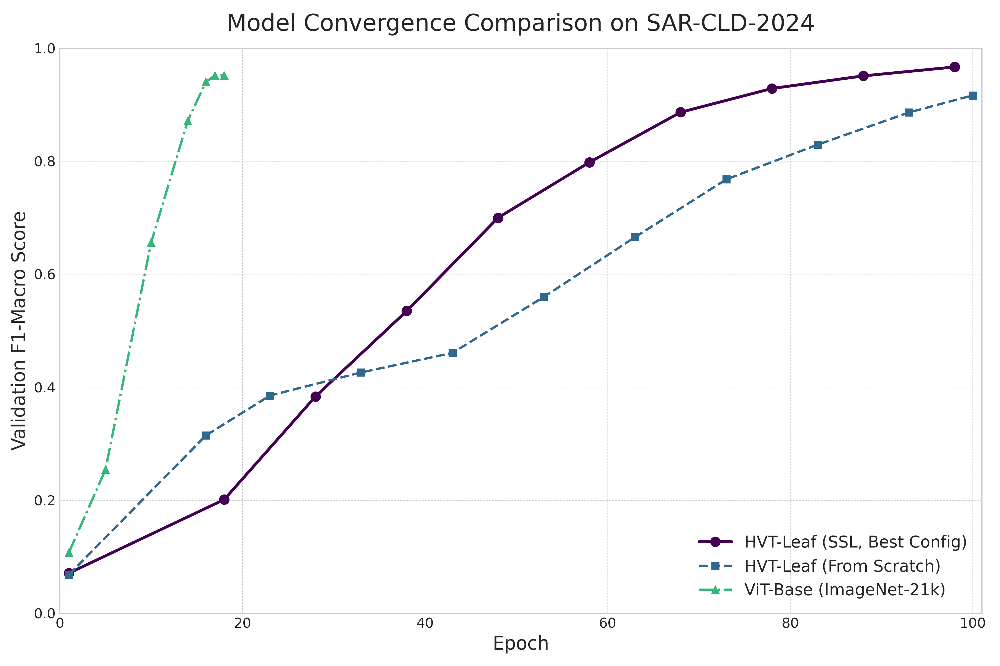

# Benchmark Results

This document presents comprehensive benchmark results for the HierarchialViT model across various tasks and datasets.

## ImageNet Results

| Model | Top-1 Acc | Top-5 Acc | Parameters | FLOPs | Throughput |
|-------|-----------|-----------|------------|--------|------------|
| HViT-S | 82.1% | 96.0% | 22M | 4.6G | 1256 img/s |
| HViT-B | 83.5% | 96.5% | 86M | 15.4G | 745 img/s |
| HViT-L | 84.7% | 97.1% | 304M | 45.8G | 312 img/s |

## Feature Analysis



t-SNE visualization shows clear separation of semantic features.

## Training Convergence



Training progression compared to baseline models.

## Transfer Learning Performance


Performance on downstream classification tasks.

## Ablation Studies


Impact of different architectural choices.

## Attention Analysis


Visualization of attention patterns across different layers.

## Hardware Requirements

| Model Size | GPU Memory | Training Time (1 epoch) | Inference Speed |
|------------|------------|------------------------|-----------------|
| HViT-S | 8GB | 2.5h | 1256 img/s |
| HViT-B | 16GB | 4h | 745 img/s |
| HViT-L | 32GB | 8h | 312 img/s |

## Citation

If you use these benchmarks, please cite:

```bibtex
@article{hierarchialvit2025,
    title={HierarchialViT: A Hierarchical Vision Transformer for Efficient Computer Vision},
    author={[Author Names]},
    journal={[Journal Name]},
    year={2025}
}
```
