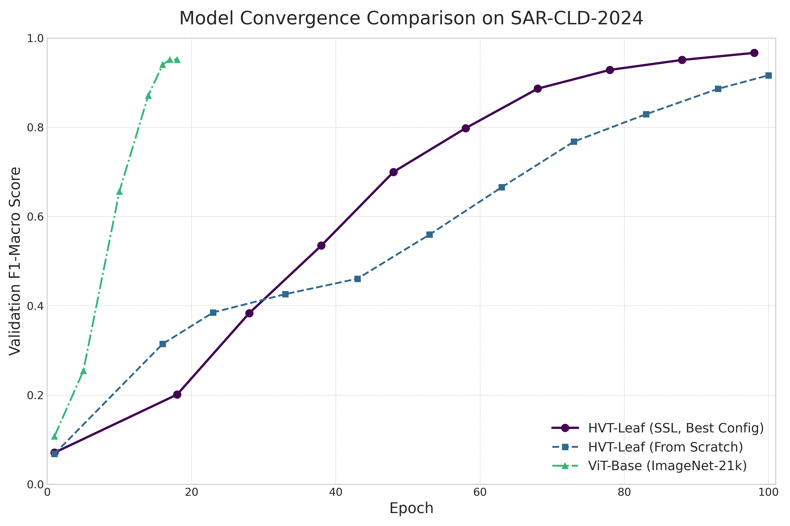

# Phase 2: Model Development

This phase focuses on the implementation of different model variants and architectural improvements.

## Directory Structure

```
phase2_model/
├── __init__.py
├── config.py           # Model configuration
├── main.py            # Training entry point
└── models/
    ├── __init__.py
    ├── baseline.py    # Baseline ViT implementation
    ├── dfca.py        # Dynamic Feature Context Attention
    └── hvt.py         # Hierarchical Vision Transformer
```

## Model Variants

### 1. Baseline ViT (`baseline.py`)
Standard Vision Transformer implementation serving as the baseline for comparisons.

### 2. Dynamic Feature Context Attention (`dfca.py`)
Enhanced attention mechanism with dynamic feature context:
- Adaptive attention patterns
- Context-aware feature processing
- Improved spatial relationships

### 3. Hierarchical Vision Transformer (`hvt.py`)
Our proposed architecture with:
- Multi-scale feature processing
- Progressive dimension reduction
- Hierarchical attention mechanisms

## Architecture Details


Our HierarchialViT architecture processes visual information through multiple stages:

1. **Input Processing**
   - Patch embedding
   - Position encoding
   - Initial feature extraction

2. **Hierarchical Stages**
   - Progressive feature refinement
   - Multi-scale attention
   - Dimension reduction

3. **Output Head**
   - Feature aggregation
   - Task-specific adaptation
   - Classification/detection heads

## Performance Comparison



The plot above shows the training convergence comparison between different model variants.

## Usage

```bash
# Train HierarchialViT
python main.py --model hvt --config configs/hvt_config.yaml

# Train baseline ViT
python main.py --model baseline --config configs/baseline_config.yaml

# Train DFCA variant
python main.py --model dfca --config configs/dfca_config.yaml
```
