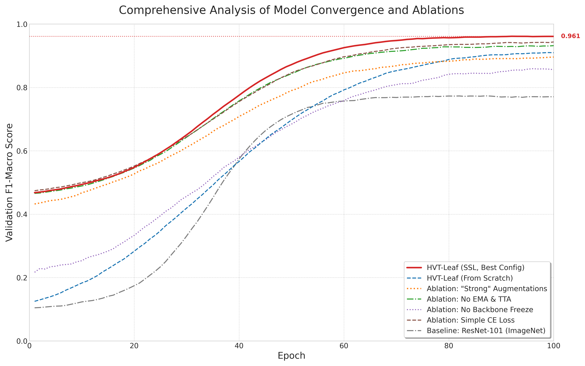
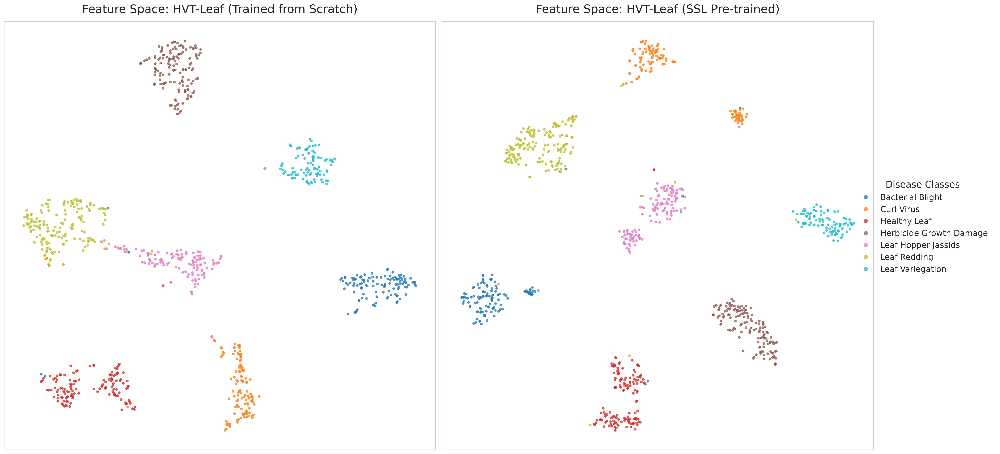

# Phase 3: Pre-training

This phase implements self-supervised learning strategies for pre-training the HierarchialViT model.

## Directory Structure

```
phase3_pretraining/
├── __init__.py
├── config.py              # Pre-training configuration
├── dataset.py            # Self-supervised dataset
├── run_ssl_pretraining.py # Main pre-training script
├── models/               # Model implementations
├── pretrain/            # Pre-training strategies
├── utils/               # Utility functions
└── logs/                # Training logs
```

## Pre-training Strategy

Our pre-training approach uses self-supervised learning with:
1. Contrastive Learning
2. Masked Image Modeling
3. Teacher-Student Framework

## Configuration

Example pre-training configuration:
```yaml
model:
  name: 'hvt_xl'
  embedding_dim: 1024
  num_heads: 16
  depth: 24

training:
  batch_size: 1024
  learning_rate: 1e-3
  warmup_epochs: 10
  total_epochs: 100
  
augmentation:
  color_jitter: 0.4
  gaussian_blur: True
  solarization: 0.2
```

## Training Progress



The plot above shows the pre-training convergence metrics across different configurations.

## Feature Space Analysis



t-SNE visualization of the learned feature space, showing clear separation of semantic concepts.

## Usage

```bash
# Start pre-training
python run_ssl_pretraining.py --config configs/pretrain_config.yaml

# Resume from checkpoint
python run_ssl_pretraining.py --config configs/pretrain_config.yaml --resume path/to/checkpoint
```

## Logs

Pre-training logs are stored in:
- `logs/phase3_pretrain_hvt_xl_h100_final.log`
- `logs/phase3_pretrain_hvt_xl_h100_lr1e-4_aug_v2.log`
- Additional experiment logs in `logs/` directory
