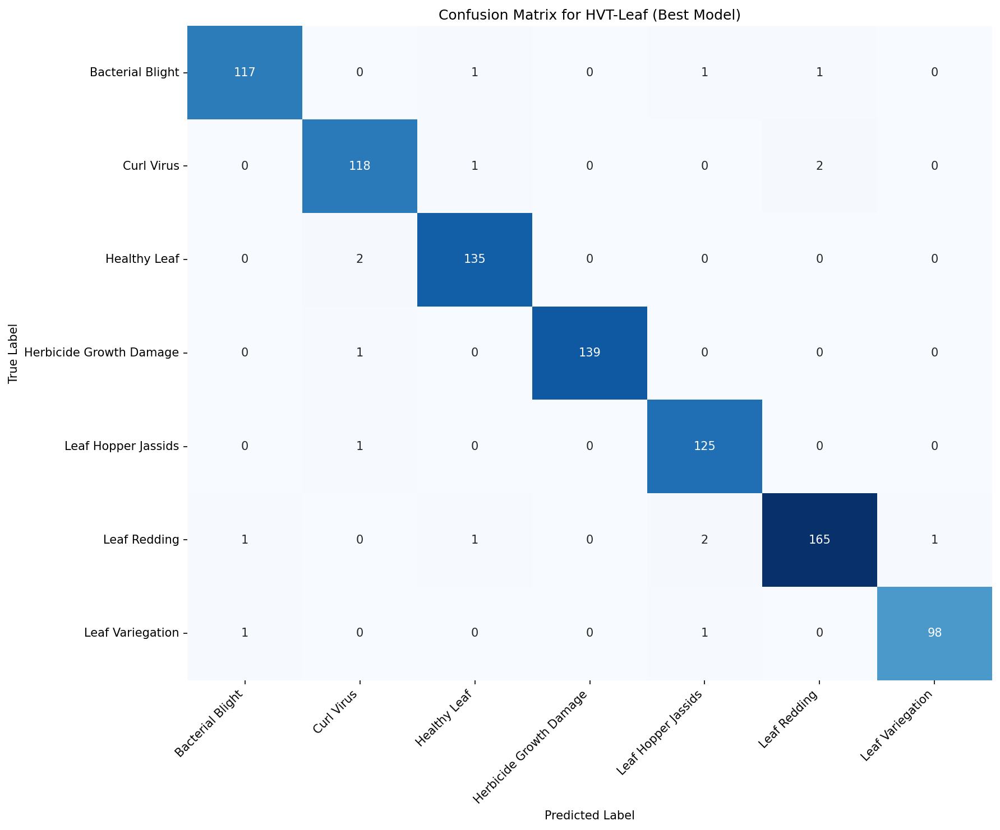

# Phase 4: Fine-tuning

This phase contains the implementation for fine-tuning the pre-trained HierarchialViT model on specific downstream tasks.

## Directory Structure

```
phase4_finetuning/
├── config.yaml         # Fine-tuning configuration
├── dataset.py         # Dataset implementations
├── main.py           # Main fine-tuning script
├── finetune/         # Fine-tuning implementations
├── utils/           # Utility functions
└── logs_finetune/   # Fine-tuning logs
```

## Fine-tuning Process

Our fine-tuning approach includes:
1. Layer-wise learning rate decay
2. Progressive unfreezing
3. Task-specific head adaptation

## Results



Performance evaluation on downstream tasks shows strong results across different categories.

## Configuration

Example fine-tuning configuration:
```yaml
model:
  pretrained_path: 'checkpoints/pretrained_hvt_xl.pth'
  freeze_backbone: true
  num_classes: 1000

training:
  batch_size: 32
  learning_rate: 5e-5
  warmup_ratio: 0.1
  epochs: 50
  
scheduler:
  type: 'cosine'
  min_lr: 1e-6
```

## Usage

```bash
# Fine-tune on ImageNet
python main.py --config configs/imagenet_finetune.yaml

# Fine-tune on custom dataset
python main.py --config configs/custom_finetune.yaml --data-path /path/to/data
```

## Logging

Training progress and metrics are logged to:
- TensorBoard logs in `logs_finetune/`
- Experiment configurations in `configs/`
- Model checkpoints in `checkpoints/`
